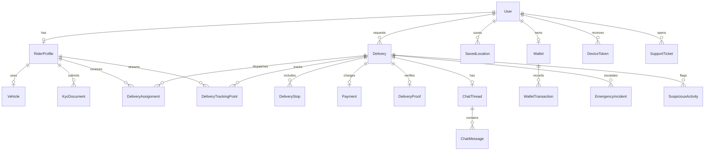

# Database And ERD

The Prisma schema in `apps/api/prisma/schema.prisma` is the implementation source. This document explains the main relationships.

## Core Tables

- `User`: Customers, riders, admins, support, and operations users.
- `RiderProfile`: Rider-specific status, KYC, live location, facial verification hash, and performance.
- `Delivery`: Main order lifecycle, addressing, pricing, ETA, category, and status.
- `DeliveryAssignment`: Offer, acceptance, rejection, expiry, score, and rider link.
- `DeliveryTrackingPoint`: Live rider GPS stream.
- `Payment`: MTN MoMo, Paystack, wallet, or cash-on-delivery status.
- `Wallet` and `WalletTransaction`: Customer/rider balance, refunds, payouts, and incentives.
- `SavedLocation`: Local addressing with landmarks, voice notes, and WhatsApp pins.
- `Geofence`: Service areas, surge areas, restricted zones, and city-level availability.
- `PricingRule`: Dynamic category and location pricing.
- `SupportTicket`: Complaint handling and operational escalation.
- `SuspiciousActivity`: Fraud detection and risk review.

## Indexing Recommendations

- `Delivery(status)` for admin monitoring and dispatch.
- `Delivery(customerId, createdAt)` for customer history.
- `DeliveryTrackingPoint(deliveryId, capturedAt)` for route replay.
- `DeliveryAssignment(deliveryId, status)` and `(riderProfileId, status)` for dispatch state.
- Add PostGIS for geospatial production workloads when the service needs radius queries, geofence containment, and high-volume matching.

## Future Database Upgrades

- PostGIS `geography(Point, 4326)` for rider and delivery coordinates.
- TimescaleDB or partitioned tables for tracking points at scale.
- Read replicas for admin analytics.
- Event outbox table for reliable notification and payment webhooks.
